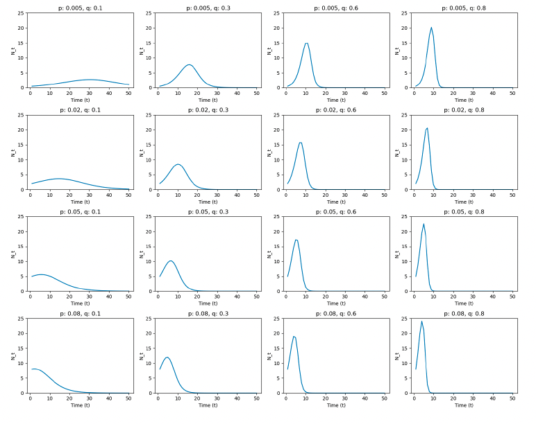

# Bass Model for Demand Prediction

**category_specifier** : "Marketing Analytics"

**Reference Docs:** [Linear Regression and Coefficient](Linear Regression and Coefficient.md)

## **Motivation**

(Image source: Wikipedia)

* Demand over time (new adopted users) usually Increase → Peak → decrease (since number of population is limited)
* ***How can we estimate market demand of product, with given data?***
* Objective: Assessing future demand, when will it peak and fall.

## **Framework**

### **Settings**

$$ M: \text{Market Size} $$

$$ N(t): \text{Number of new customers at time t}  $$ 

$$ A(t) = \sum_{i=1}^{t-1}N(i): \text{Accumulative `already customers' prior to time t }  $$ 

$$ R(T) = M - A(t): \text{Remaining customers at t} $$

$$ p : \text{Coefficient of innovation} $$ 

$$ q: \text{Coefficient of imitation} $$ 

### **Bass model is motivated by 'Hazard Rate'**

* Hazard rate: ***Probability of event occurring ‘given that’ the event not already occurred:***
  $$ H(t) = \frac{N(t)}{R(t)}$$, where $$
* In marketing context: Probability of becoming a customer, given that they are not customer yet.
* Bass model assume this is equal to:
  $$H(t)  = p + q \frac{A(t)}{M} $$
  * **Interpretation** : Innovation (customers make decision to use new product by themselves) + imitation (Imitate others' activity as product spread out) * ratio of already customers in the market. 

### Further Formulation

$$ H(t) = \frac{N(t)}{R(t)}= p + q \frac{A(t)}{M} $$ 

* Here, we can drive:

$$
N(t) = H(t) \times R(t) \\
= [p + q \frac{A(t)}{M}] \times R(t) \\
= Mp + (q-p)A(t) - \frac{q}{M}[A(t)]^2
$$

## **When we know p, q, M, we can predict the demand curve**

- In this model, if we know variables $M, p, q$:
  - $A(1) = 0, R(1) = M$ → Get the Initial value at time $t$
  - Get $H(t) = p + q \frac{A(t)}{M}$
  - Get $N(t) = H(t) * R(t)$
    - $N(1) = H(1) * R(1)$
  - Get $A(t+1)$
    - Iterate over time series $t$ to get future demand curve: $A(2) = N(1) + A(1) = N(1)...$

### **Takeaways**

#### **Interpretation of the curve**

- Usually, $p < q$ (imitation effect is larger)
  - Most people are reluctant to adopt new things. They want validation until others buy, and test products. (conservative)
- There are 2 exceptional categories on this:
  1. Value itself is evident (e.g. : Electricity over traditional lights)
  2. Risk itself is so small (low cost): App download.
- **Most common shape of the curve : Increase → Peak → Decrease**

#### **More about $p, q$**

- $p$ effects on earlier phase, $q$ effects on later phase.
- Larger p: Peak of the curve become earlier (faster)
- Larger q: Reach to the peak faster (slope) and peak be higher
- They both impact slope (Speed of adoption)

#### **4 Main utilization of the curve for marketing decisions**

1. How ‘high’ the curve peak will be
2. How ‘shallow’ the curve is (Derivative. How fast growing it is)
   * If curve is predicted to be shallow, outsourcing will be more effective.
3. If the product is in Earlier / Later part of the curve (Innovator VS Imitators)
   * If the curve is in early stage, target innovators. If not, target imitators.
4. When will the curve end. (Prepare for the next generation product)

→ Decisions should be mostly made based on $R$ (potential customers in market), not $M$ (entire population in the market.)

## **How to estimate values of $p, q, M$**

**In bass model, p, q, M are unknown, and we need to predict those values**

$$ N(t) = Mp + (q-p) * A(t) - \frac{q}{M}[A(t)]^2 $$

* The formulation above could be written as [Linear Regression](Linear Regression and Coefficient.md) of variable $A(t)$.
* Regress $N(t) ~ A(t)$: $N(t) = a + bA(t) + cA(t)^2$, by replacing $a = Mp, b = (q-p), c = -\frac{q}{M}$
* After getting a, b, c, we can reorganize:
  - $p = \frac{\sqrt{b^2-4ac}-b}{2}$
  - $q = \frac{\sqrt{b^2-4ac}+b}{2}$
  - $M = -q/c$
* After having $p, q, M$ value, extrapolate future values, as explained in previous section.

## **Caution: Do not get $M$ from the regression - acquire from external source**

* Bass model is very sensitive to errors: predicted curve will vary a lot given the data is impacted by variability.
* $M$ is especially impacted a lot - $p, q$ are not impacted as much as $M$.
* Therefore, total market size $M$ should better be estimated through external source - one example is using chain ratio method to estimate total market size.

### **Important takeaway**

When $M$ is sourced from outside, it becomes a ***fixed number***. Therefore, the equation if not linear anymore, so there is no closed for solution. 

Therefore, $p, q$ value should be estimated using nonlinear regression techniques, with Python packages like ***Gradient based optimization method.*** 
