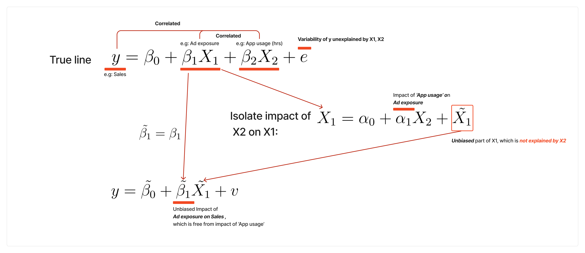

# Frisch-Waugh Theorem

**category_specifier**:  "Concept, Methodology"

Related Knowledge DB Docs Management: Using control variables (https://www.notion.so/Using-control-variables-1bebcb043bfc80f8a627cfce697b73dc?pvs=21), Omitted Variable Bias (OVB) (https://www.notion.so/Omitted-Variable-Bias-OVB-1bebcb043bfc80b6aecad458ccb6c637?pvs=21)

# Motivation

- When there is OVB ([Omitted Variable Bias (OVB)](https://www.notion.so/Omitted-Variable-Bias-OVB-1bebcb043bfc80b6aecad458ccb6c637?pvs=21)) in linear model for an experiment (or observational data for treatment effect, and want to get ***unbiased estimator of this treatment effect, withouth regressing with entire variabled.***

# Framework

💡**When you know that the treatment is not randomizes (or partially randomized because it assigned experiment based on some characteristic, like demographic), we can use FW to control bias.**

- You did not have experiment, and do have observation data
- You assume that the following equation is true line, while $X_1$ is treatment variable (0, 1), $X_2$ is control variable.

$$
y =\beta_0 + \beta_1X_1 + \beta_2X_2 + e
$$

- Follow the 2-step regression below:
    1. Regress treatment on other control variables:  
        - $X_1 = \alpha_0 + \alpha_1X_2 + \tilde{X_1}$
        - Implication of $\tilde{X_1}$: Part $X_1$ which is not explained by $X_2$
    2. Regress $y$ on $\tilde{X_1}$
        - $y = \tilde{\beta_0} + \tilde{\beta_1}\tilde{X_1} + v$
    3. then , $\tilde{\beta_1} = \beta_1$