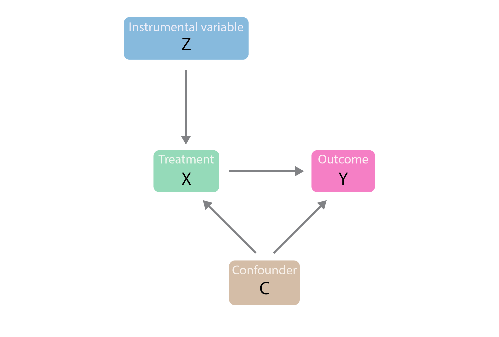

# Instrument Variable

**category_specifier** : "Causal Inference"

**Reference Docs:** [Omitted Variable Bias](Omitted Variable Bias.md) | [Endogeneity and Exogeneity](Endogeneity and Exogeneity.md)

## **Motivation**

💡**I can’t run an experiment, but I want to know the causal effect.**

- You lack a clean A/B test or random assignment.
- You suspect **non-random selection into treatment**.
- IV is a method born out of necessity - when **experiments aren’t feasible** and **OLS is unreliable**, IV becomes a powerful tool for credible causal inference.

## **The IV Solution**

IV introduces a **third variable (Z),** the **instrument,** which:

1. **Is correlated with X (relevance) :**

$$  Cov(Z, X) ≠ 0 $$

1. **Is not directly correlated with Y (exogeneity) :**

$$ Cov(Z, e) = 0 $$

This allows you to use **only the part of X that is “as good as random”** (driven by Z), isolating a causal estimate of $\beta_1$.

## **When Do We Use IV?**

Use IV when you suspect the explanatory variable (**X**) is **correlated with the error term** (**e**) in your model:

$$ Y = \beta_0 + \beta_1 X + e \quad \text{where } \text{Cov}(X, e) \neq 0 $$

This breaks the OLS assumption and leads to **biased estimates**.

## **Visual Representation**

In a **causal graph**:

- Z → X → Y
- Z → X must exist (relevance)
- Z → Y directly (exogeneity)

## **TSLS: Two-Stage Least Squares**

A common IV estimation technique:

1. **First Stage**:

   Regress X on Z:

   $X = \pi_0 + \pi_1 Z + u$

   Use predicted $\hat{X}$

2. **Second Stage**:

   Regress Y on $\hat{X}$

   $Y = \beta_0 + \beta_1 \hat{X} + \epsilon$

   The estimated $\beta_1$ is now **unbiased**, assuming instrument validity.

## **Examples & Use Cases**

- **Demand estimation**: Use weather shocks or tax variation to instrument for prices.
- **Crime and incarceration**: Use prison overcrowding litigation as an instrument.
- **Class size and student performance**: Use earthquake-driven classroom reallocations.
- **Birth weight and smoking**: Use state-level cigarette prices as an instrument for maternal smoking.

## **Testing for Validity**

- **Relevance**: Look at **F-stat** in the first stage. Rule of thumb: **F > 10** is strong.
- **Exogeneity**: Testable only if you have **more instruments than endogenous variables** using the **J-test** (Sargan test).

## **Generalizations**

- Can include **multiple instruments** and **control variables**.
- Must ensure the model is at least **exactly identified** (number of instruments ≥ number of endogenous regressors).
- **Weak instruments** bias TSLS toward OLS - use with caution!

## **Software Notes**

- In **Python**: Use `IV2SLS` from `linearmodels.iv`
- In **R**: Use `ivreg` from the `AER` package
