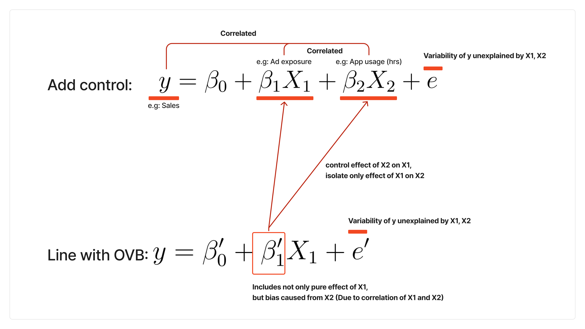

# Using Control Variables

**category_specifier** : "Causal Inference"

**Reference Docs:** [Frisch Waugh Theorem](Frisch Waugh Theorem.md) | [AB Testing Framework With Regression](AB Testing Framework With Regression.md) | [Omitted Variable Bias](Omitted Variable Bias.md) | [Standard Error](Standard Error.md) | [Linear Regression and Coefficient](Linear Regression and Coefficient.md)

## **Motivation**

### **In randomized AB test**

💡**What should we do if, significance is low for A/B test?**

- Adding control variable is one of three ways to help improving precision of AB Testing Framework With Regression (Lowering SE of regression coefficient estimate $\beta$)
  - Choosing 50:50 for probability of control, treatment to maximize $Var(X)$
  - Choosing right sample size to lower Standard Error
  - **Adding control variables in AB test**

### **In observational data**

- If you don’t, or can’t run random experiment, you cannot make causal interpretation in observational data
- How can we make ***the best*** causal claim from observational data, if you cannot run experiment? 
- Adding control variables can ***isolate random variation***, and remove **‘non random’ part** of each variable. This can control some extent of [engogeneity](Endogeneity and Exogeneity.md).
- Adding control variable can help controlling [Omitted Variable Bias](Omitted Variable Bias.md)

## **Framework**

### **If you have run random A/B test**

#### **Settings**

- Consider univariate [regression for a A/B test](AB Testing Framework With Regression.md)

$$ Target = \beta_0 + \beta_1 * treatment + e $$

- Then, consider multivariate regression for the same A/B test.

$$ Target = \gamma_0 + \gamma_1 * treatment + \gamma_2X_2 + \gamma_3X_3 + ... + u $$

- $Target$ could be target variable as **sales,** while $X_2, X_3 ...$ could be all other available variables (data we have: e.g. )

#### **Takeaways**

- Here, $Var(\beta_1) \geq Var(\gamma_1)$ always holds, ***which means adding up control variable can reduce error (improve precision) of the A/B test coefficients.***
- CAUTION: For randomized AB test, we are not adding control variables for [Omitted Variable Bias](Omitted Variable Bias.md)  - there is no OVB if we have randomized AB test.

### **If you only have observational data**

#### **Settings**

$$ y =\beta_0 + \beta_1 * treatment+ e $$

- You don’t have AB test results, but only observational data which is likely to have [Omitted Variable Bias](Omitted Variable Bias.md)), because assignment of treatment is not random for each of the variables.
- Here, $\beta_1$ represents effect of the treatment, while $e$ contains all the variation not explained by the treatment.

$$ y =\beta_0' + \beta_1' * treatment  + \beta_2X_2 +e' $$

- By adding omitted variable $X_2$ as control, $\beta_1'$ will be **less biased,**

   removing bias caused by relationship between treatment and $X_2.$

  - Since $OVB = \beta_2 * \frac{Cov(treatment, X_2)}{Var(X_2)}$ ([Omitted Variable Bias](Omitted Variable Bias.md))), if $Cov(treatment, X_2)$ is not 0, $\beta_1'$ will change.
- Since treatment is not randomly assigned regarding $X_2$, $Cov(treatment, X_2)$ is not likely to be 0

#### **Takeaways**

- $\tilde{X_1}$ represents the portion of $X_1$(treatment) that is not correlated with other variables.
- This allows us to estimate the **true random treatment effect** more accurately.
- By **adding a control variable**, we isolate the **random effect of** $X_1$removing confounding influences.
- Specifically, controlling for $X_2$ ensures that the variation in $X_1$ used for estimation is **uncorrelated with**  $X_2$ , leading to an **unbiased estimate of the treatment effect**.
